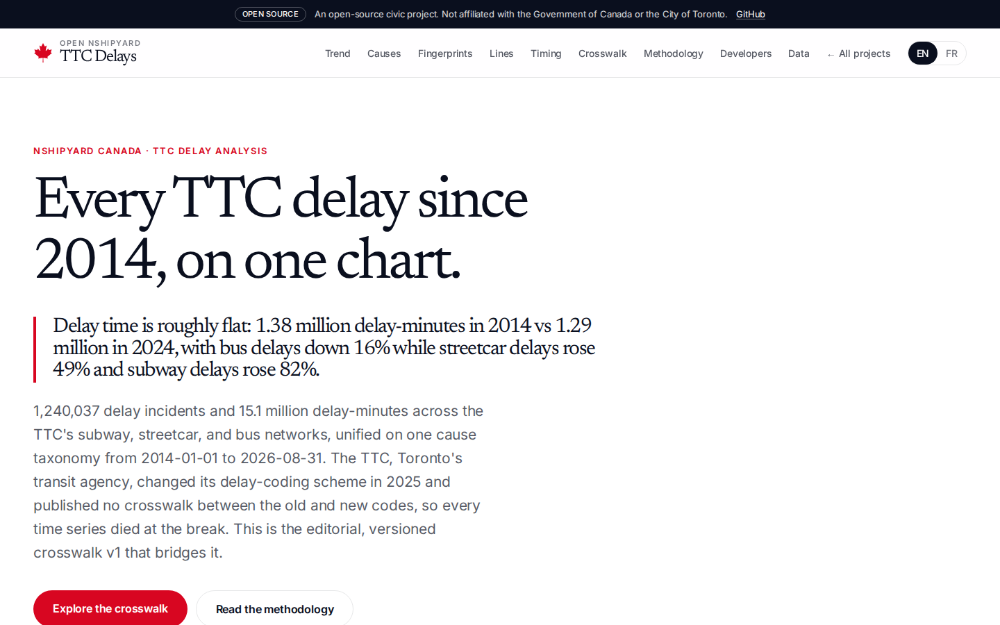
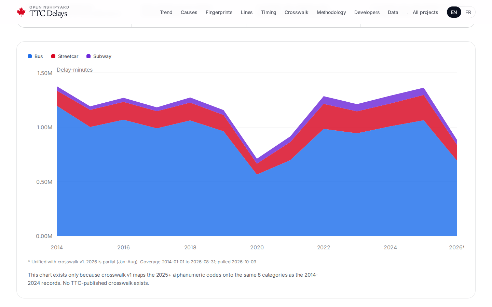
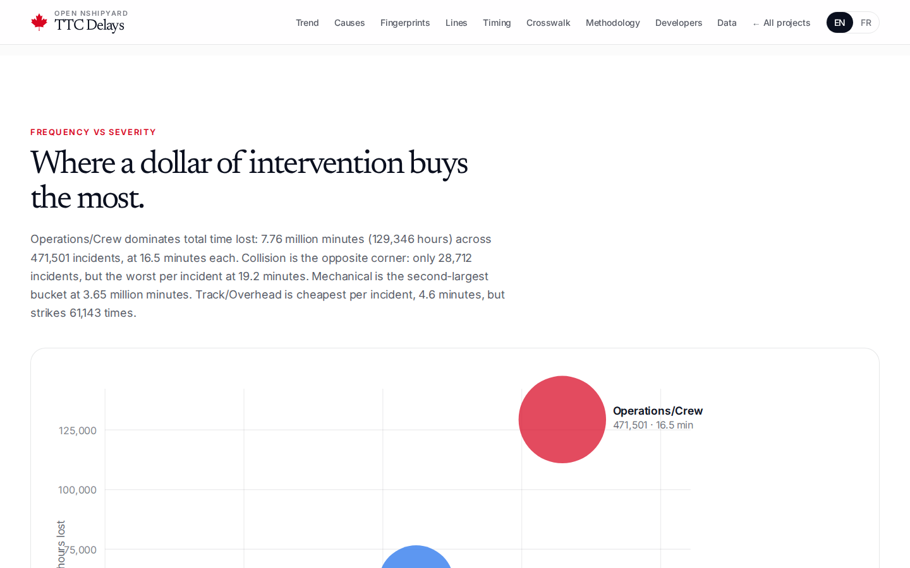
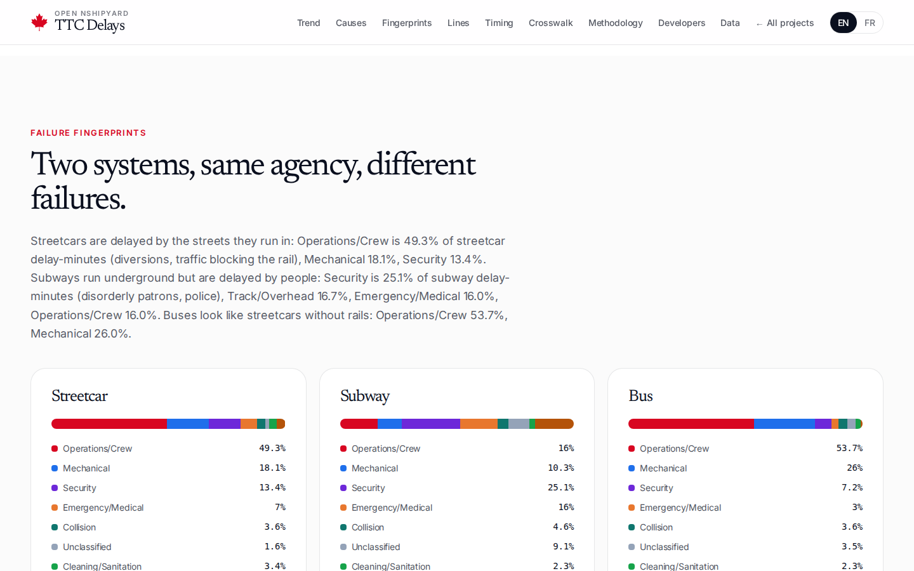
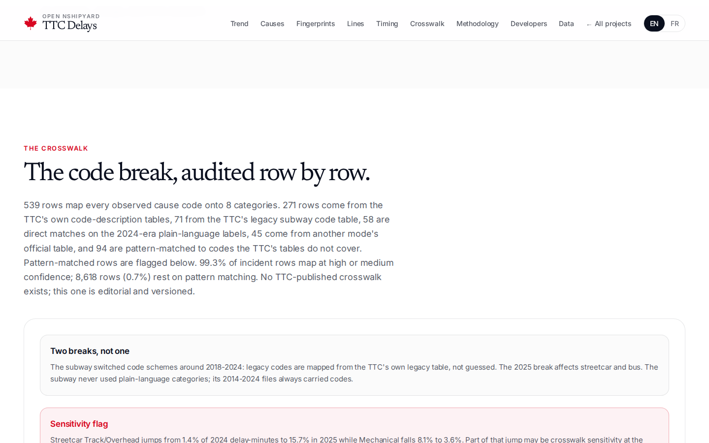
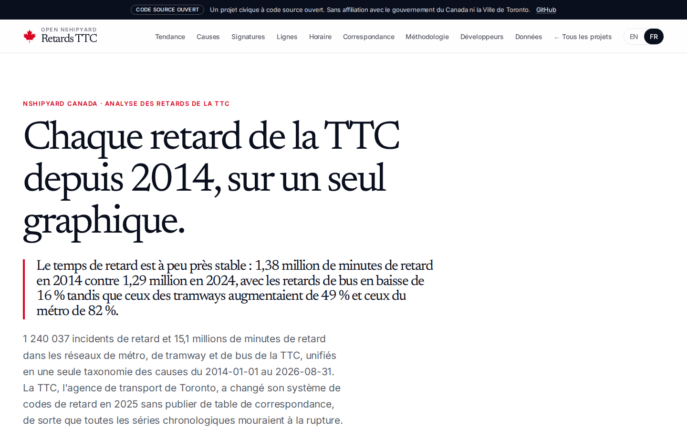
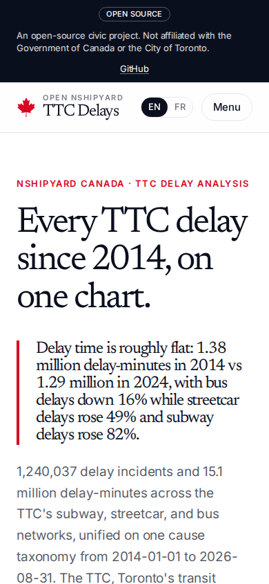
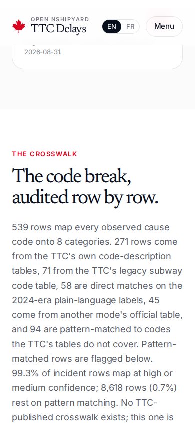

# TTC Delays, One Taxonomy

Is the TTC getting better or worse, and what is causing the delays? 1,240,037 delay incidents and 15.1 million delay-minutes across subway, streetcar, and bus (2014-01-01 to 2026-08-31), unified on one cause taxonomy with the editorial crosswalk v1 that bridges the 2025 code break.

Live: https://ttc.canada.nshipyard.com

## Screenshots

## Data sources

All three datasets are City of Toronto Open Data, Open Government Licence - Toronto. Pulled 2026-10-09; portal last refreshed 2026-09-21; coverage 2014-01-01 to 2026-08-31 (2026 partial, January through August).

- TTC Subway Delay Data: https://open.toronto.ca/dataset/ttc-subway-delay-data/
- TTC Streetcar Delay Data: https://open.toronto.ca/dataset/ttc-streetcar-delay-data/
- TTC Bus Delay Data: https://open.toronto.ca/dataset/ttc-bus-delay-data/

Exact resource IDs, vintages, and pull dates: `data/resource_meta.json`. The cleaned incident table is `data/incidents_clean.parquet` (1,240,037 rows, 17.9 MB); the aggregates behind every figure are `data/aggregates/`; the export script `scripts/export_site_data.py` reproduces every site figure from them.

## Methodology summary

1. **Ingest.** Subway: yearly XLSX 2014-2024 (12 monthly sheets each) plus the rolling "TTC Subway Delay Data since 2025" CSV. Streetcar and bus: yearly XLSX 2014-2024 plus rolling 2025+ CSVs. Code-description tables joined first: 140 subway codes, the TTC legacy subway table (71 codes), 85 streetcar codes, 46 bus codes.
2. **Normalize.** Monthly-sheet column renames (Gap/Delay, Incident ID), bus/streetcar Route/Line vs subway Line/Bound differences, and 117 subway station spelling variants mapped to canonical names (2,099 rows). One incident-level table: date, time, mode, line/route, station/location, raw cause code, crosswalked cause category, delay minutes, day of week, hour.
3. **Clean.** Dropped: Line placeholders 999/500 (1,752 rows), Min Delay exactly 999 as data-entry cap (1,235), Min Delay over 300 minutes (5,391), negative Min Delay (10). Zero-minute rows kept but flagged (221,620). Raw rows 1,248,435; cleaned 1,240,037. Exact counts in `data/cleaning_log.json`.
4. **Aggregate.** Delay-minutes (summed) and incidents (row counts) by year x mode x category, line, route, hour, weekday; frequency-severity per category and per code. Average minutes per incident is total minutes divided by incidents.
5. **Crosswalk v1.** 539 rows mapping every observed cause code to 8 categories (Operations/Crew, Security, Mechanical, Cleaning/Sanitation, Emergency/Medical, Collision, Track/Overhead, Unclassified). No TTC-published crosswalk exists; this one is editorial and versioned.

Full detail: the Methodology section on the site, and `data/README.md`.

## Crosswalk v1

`data/crosswalk_v1.csv`: (mode, cause_code) to category, with method and confidence per row.

- Methods: official 271 (from the per-mode Code Descriptions tables), official-legacy 71 (the TTC legacy subway table), direct-label 58 (plain-language era labels), cross-mode-official 45 (another mode's official table), pattern 94 (prefix/suffix rules for codes in no official table).
- Confidence: high 416, medium 67, low 56. By incident rows, 99.3% map at high or medium confidence; 8,618 rows (0.7%) rest on pattern matching; zero rows unmapped.
- Two breaks bridged: the subway scheme switch around 2018-2024 (legacy codes mapped from the TTC's own legacy table) and the 2025 streetcar/bus break to alphanumeric codes.

## What the data says (verified figures)

- Total delay time fell 6% between 2014 (1,376,820 minutes) and 2024 (1,289,281 minutes): bus down 16%, streetcar up 49% (140,112 to 208,998), subway up 82% (39,625 to 72,087). The 2025 figure (1,363,898) is the first year on new codes; cross-break comparisons are approximate.
- Subway line shares: Line 1 (Yonge-University) 50.5%, Line 2 (Bloor-Danforth) 39.4%, Line 3 6.0%, Line 4 4.0%. No public ridership denominator exists, so per-rider rates cannot be computed.
- Streetcar failure fingerprint: Operations/Crew 49.3%, Mechanical 18.1%, Security 13.4%. Subway: Security 25.1%, Track/Overhead 16.7%, Emergency/Medical 16.0%.
- Disorderly-patron (subway code SUDP) incidents peak at 5 PM (1,398 in hour 17), not late evening. Sunday incidents average 13.8 minutes, about 14% longer than Friday's 12.1.
- Checked and rejected: streetcars do not lose more time to cars parked on the tracks than to mechanical breakdowns. Auto-foul-rail codes total 36,728 minutes across 1,394 incidents; Mechanical totals 400,253 minutes across 47,547 incidents, roughly 11x larger.

## Caveats

- No ridership denominators exist in public data; per-rider delay rates cannot be computed.
- The TTC logs a single primary cause per incident; delays under 1 minute are not consistently logged.
- The 2024-to-2025 crosswalk is editorial, not official; year-over-year comparisons across the break are approximate.
- Zero-minute rows were kept and flagged: subway logs zero minutes on 65% of incidents (a stable TTC convention), streetcars 22.0% in 2025+, buses 12.4%.
- Watch streetcar Track/Overhead: 1.4% of 2024 delay-minutes vs 15.7% in 2025 while Mechanical falls 8.1% to 3.6%. Part of the jump may be crosswalk sensitivity at the break.

## API

REST base `/api/v1`: `delays/summary`, `delays/by-mode?mode=subway`, `delays/by-year?year=2024`, `delays/by-line`, `delays/by-cause?category=Mechanical`, `delays/crosswalk?q=SUDP&mode=subway`, `delays/heat`, `delays/metadata`. OpenAPI 3.1 at `/api/openapi.json`. MCP tools over streamable HTTP at `/mcp` (initialize, tools/list, tools/call).

## Reproducing

Pipeline: `scripts/download_resources.py` -> `scripts/observed_codes.py` -> `scripts/build_crosswalk.py` -> `scripts/ingest.py` -> `scripts/build_aggregates.py` -> `scripts/export_site_data.py`. Requirements: pandas, openpyxl, pyarrow. See `docs/REPRODUCE.md`.

## Author

Built by Richardson Dackam: https://x.com/richardsondx and https://github.com/richardsondx
